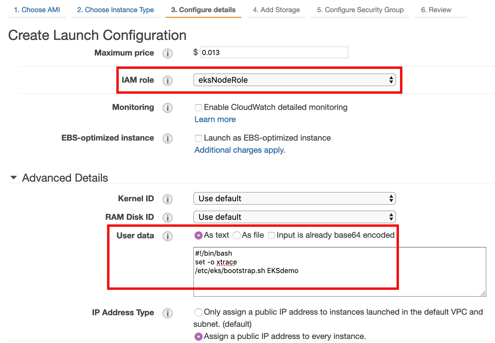

# Mount Node Instances to EKS Cluster(Master).

## Overview

[**Kubernetes**](https://kubernetes.io/docs/home/) (commonly stylized as **k8s**) is an **open-source container orchestration system** for automating application deployment, scaling, and management. It aims to provide a "platform for automating deployment, scaling, and operations of application containers across clusters of hosts". It works with a range of container tools, including [**Docker**](https://www.docker.com/).

<p align="center">
    
</p>

[**Amazon Elastic Container Service for Kubernetes (EKS)**](https://aws.amazon.com/eks/) makes it easy to deploy, manage, and scale containerized applications using **k8s** on AWS. With **EKS**, you should no longer worry about your **Control Plane Management**. 

Using **EKS**, you can build your cluster and worker nodes in your own **VPC**, then set security group and NACL to enhance your **security**.

<p align="center">
    
</p>

## Scenario

There are several tools that help you create a Cluster in EKS including [terraform](https://www.terraform.io/), [eksctl](https://github.com/weaveworks/eksctl)... etc. With these tools, you can create an **EKS cluster** and it's **node groups** in easy way. But what if you **already have an empty cluster in EKS** without any working nodes? You need to **create node groups** yourself and **mount them** on your EKS.

## Prerequisites

* Make sure your region is in **us-east-1**.
* You need to prepare an **AWS Cloud 9** environment to execute kubernetes operations.
* In this lab, you are going to create eks cluster with **IAM role**. To do that, you need to **disable your AWS Credential**, and **attach AdministratorAccess policy** to your Cloud9 EC2 instance.

## Step by step

### Setting EKS Environment

To meet our scenario, you will create an empty cluster first. If you already have one, please skip to [Download Tools](#Download-Tools). 

Before you create EKS cluster, you need to create Network Environment first. It should contain **VPC, subnets, and EKS master node's security group**. Then you need to create **IAM role** for your EKS Cluster. 

* Use **VPC Wizard in VPC dashboard** to create VPC with a public subnet.

* Create **another public subnet** to ensure your cluster work nodes cross-AZ.

>You can also create private subnets with NAT Gateway to make sure your node groups can connect to EKS Cluster.

* (Important!!) Tag your VPC and all subnets with :
    * Key: ```kubernetes.io/cluster/<Your Cluster Name>```
    * Value: ```shared``` 
    > Remeber to change <Your Cluster Name\> to your own Cluster name.


<p align="center">
    
</p>

>If you skip this step, kubernetes server would not find your eks cluster.

* Create master's **Security Group**, name it **EKS control plane security group**, select the **VPC you just created**.

* Add inbound rule **All traffic** to its own **Group ID**, so that master nodes can communicate with each other.

* Create **IAM Role**, in **Service use this role** choose **EKS**, and name it **eksServiceRole**.


### Create EKS Cluster

* After setting up environment, you can use **Cloud 9** to run following syntax to build your EKs cluster. Replace every <> with your own value.

```
 $ aws eks --region us-east-1 create-cluster --name <Cluster Name> --role-arn <Your eks Role arn> --resources-vpc-config subnetIds=<Subnet 1 ID>,<Subnet 2 ID>,securityGroupIds=<SecurityGroup ID>
```

>In this lab, we want to create cluster using the **identity of an EC2 instance**. If you build cluster with eks console, the **Creator** will be you. That means, you need to login your aws credential in cloud9, then login to kubernetes server to manage your cluster.

>You can use ```$ aws eks --region us-east-1 describe-cluster --name <Cluster Name> --query cluster.status``` or go to the eks console to check its status.

> This might take 10-20 minutes.

<p align="center">
    
</p>

### Download Tools

After your EKS cluster build up complete, you have to download **kubectl** and **aws-iam-authenticator** tool to login kubernetes server and manage your cluster.

> **kubectl** is kubernetes command-line tool, **aws-iam-authenticator** is an authentication mechanism that help you use AWS IAM credentials to authenticate to a Kubernetes cluster.

```
$ mkdir $HOME/bin
$ curl -o kubectl https://amazon-eks.s3-us-west-2.amazonaws.com/1.11.5/2018-12-06/bin/linux/amd64/kubectl && chmod +x ./kubectl && cp ./kubectl $HOME/bin/kubectl && export PATH=$HOME/bin:$PATH
$ curl -o aws-iam-authenticator https://amazon-eks.s3-us-west-2.amazonaws.com/1.11.5/2018-12-06/bin/linux/amd64/aws-iam-authenticator && chmod +x ./aws-iam-authenticator && cp ./aws-iam-authenticator $HOME/bin/aws-iam-authenticator && export PATH=$HOME/bin:$PATH
```

* Configure your region in **us-east-1**, then update kubeconfig by: ```$ aws eks update-kubeconfig --name <Cluster name>```.

> A kubeconfig file records your cluster's infomatation include Cluster ARN, Certificate authority... etc. It helps kubectl verify which cluster you want to manage.

### Create Node Groups

There are several ways can make you create your node groups. One is download **CloudFormation template** written by aws, you can download it from [here](https://amazon-eks.s3-us-west-2.amazonaws.com/cloudformation/2019-02-11/amazon-eks-nodegroup.yaml), then customize your own template. The other way is create node groups **manually** by yourself, if you don't know how to write CloudFormation templates, this might be the best way to create your node groups. I will explain how to do it in detail.

If you use **CloudFormation** template, please skip to [Enable Worker Nodes to Join Your Cluster](#Enable-Worker-Nodes-to-Join-Your-Cluster). If you don't, you need to create an auto-scaling group as your node group. Before you do that, you need to **build its resource** first.

#### Create Settings

* Create an **IAM Role** for work node, choose **EC2** as service, then attach three policies:  
    * ```AmazonEKSWorkerNodePolicy```
    * ```AmazonEC2ContainerRegistryReadOnly```
    * ```AmazonEKS_CNI_Policy```

* Name it ```eksNodeRole```.
> Note your **Role ARN**.

<p align="center">
    
</p>

* Create a **worker node security group**, which require inboud rules:
    * **Allow All traffic** to its **own Group ID**
    * **Allow 443 & 1025-65535 port** to **EKS control plane security group ID**.

>All traffic to itself can let worker nodes communicate with each other, allow 443, 1025-65535 port to EKS control plane security group enables the nodes to receive traffic from the master node, allow 22 port enables you to ssh into your nodes.

<p align="center">
    
</p>

* Modify your **EKS control plane security group**, add inbound rules **Allow 443 port** to **worker node security group ID**, It enables your master to receive traffic from the worker nodes.

<p align="center">
    
</p>

#### Create Launch Configuration

* Create Launch Configuration using the **optimized AMI**, choose **t3.medium** as instance type, **Check Request Spot Instances** to reduce your cost.

>You can check optimized EKS AMI from [Amazon EKS-Optimized AMI](https://docs.aws.amazon.com/eks/latest/userguide/eks-optimized-ami.html). and change instance type according to your needs.

* (Important!!) Select **IAM node Role** you just created, assign public IP to every instances, and paste following syntax in **User data**, remember to replace <Cluster Name\> with your cluster name.

```
#!/bin/bash
set -o xtrace
/etc/eks/bootstrap.sh <Cluster Name>
```

>IAM Role give worker node permissions, you will use this Role's arn to config your auth later. User data help your worker nodes connect to EKS cluster.

<p align="center">
    
</p>

* Select **node security group** you created, then choose or create a new key pairs to allow you ssh into your nodes.

* Use your Launch Configuration to create an **Auto Scaling Group**.

#### Create Auto Scaling Group

* Change group size to **2**, choose your **VPC** then **add all subnets**.

>(Optional) You can set your Scaling policy in **2. Configure scaling policies**, and set SNS in **3. Configure Notifications**.

* (Important!!) Tag your VPC and all subnets with :
    * Key: ```kubernetes.io/cluster/<Your Cluster Name>```
    * Value: ```shared``` 
    > Remeber to change <Your Cluster Name\> to your own Cluster name.

>If you skip this step, EKS worker nodes would not be found by kubernetes server.

<p align="center">
    
</p>

* Create your auto scaling group, and wait for EC2 instance running.

#### Verify RBAC

* To grant IAM users or roles other than the one you created your cluster the ability to interact with the cluster, you must edit the aws-auth ConfigMap to request permission from Kubernetes RBAC.

```
$ curl -O https://amazon-eks.s3-us-west-2.amazonaws.com/cloudformation/2019-02-11/aws-auth-cm.yaml
```

* Open the file with text editor. Replace the <ARN of instance role (not instance profile)> with your own **IAM node Role arn**.

<p align="center">
    
</p>

* Apply the configuration. This command may take about one minute to finish.

```
$ kubectl apply -f aws-auth-cm.yaml
```

### Test Node Group

If your node groups successfully mount to your master nodes, **AWS ENI** will give node EC2 instances **Secondary private IPs**, so you can run pods with them.

* Go to your **EC2 console**, then check if your node instances have Secondary private IPs.

<p align="center">
    
</p>

* Use ```$ kubectl get no ``` in **Cloud9**, you can watch the nodes status.

<p align="center">
    
</p>

## Conclusion

Now you already know how to mount worker node groups to your master nodes. You can mount more of them to your cluster depanding on your needs. However, this is just the beginning of the EKS. After you mount your worker nodes on your cluster, you finally can start deploying some pods and running task on it. For more information, you can go to our [eks workshop](https://github.com/KYPan0818/bootcamp-eks) to try more advanced labs. Hope you can have a good time on your EKS journey!

## Appendix

[Launching Amazon EKS Worker Nodes](https://docs.aws.amazon.com/eks/latest/userguide/launch-workers.html)

[Pahud's amazon-eks-workshop](https://github.com/pahud/amazon-eks-workshop)