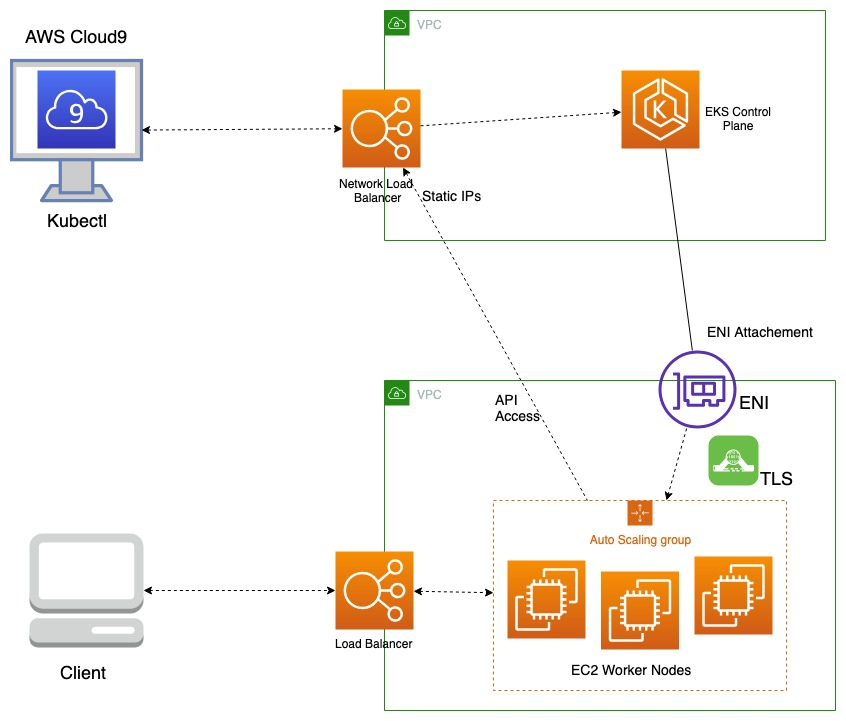
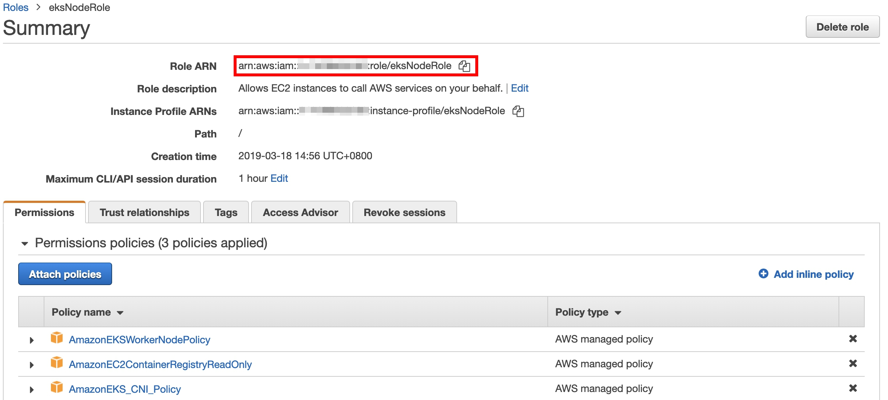
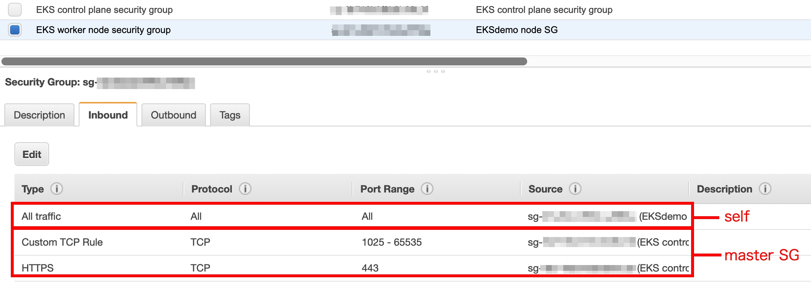
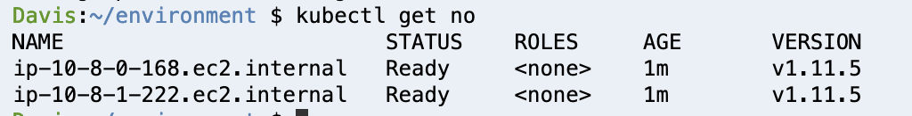

# 將工作節點掛載至 EKS 的叢集中

## 前言

[**Kubernetes**](https://kubernetes.io/docs/home/) （簡稱為 **k8s**）是一項為**自動化**部署、擴展、及管理應用程式而生的**開源容器編程系統**。其旨在提供一個可以「跨叢集中的主機進行自動化部署、擴展、及管理應用程式」的平台。而這項系統支援許多的容器工具，包括 [**Docker**](https://www.docker.com/)、[**Rocket**](https://coreos.com/rkt/)...等。

<p align="center">
    
</p>

[**Amazon Elastic Container Service for Kubernetes (EKS)**](https://aws.amazon.com/eks/) 讓用戶更輕鬆的在 AWS 平台中使用 **k8s**，進行部署、管理及擴展容器化的應用程式。 一旦使用了 **EKS**，AWS 將幫用戶託管 EKS 的控制平台，確保其能順利的運行。因此，使用者們也不必再需要擔心**控制平台管理**的問題。

透過使用 **EKS**，用戶能夠在自己的 **VPC** 底下創建工作節點及主控制平台，並透過設定 NACL、IAM 角色、安全群組...等，來增加叢集的**安全性**。

<p align="center">
    
</p>

## 情境

在市面上，已經有相當多的開發工具，協助用戶創建 EKS 叢集，例如 [terraform](https://www.terraform.io/)、[eksctl](https://github.com/weaveworks/eksctl)...等。藉由這些工具，用戶將能輕鬆的創建工作節點及群集。但是，如果用戶是已經擁有一個空白的 EKS 叢集，並想新增工作節點至此叢集中，那該怎麼辦？我們將在這篇部落格中解決此問題，藉由實際操作的方法，帶大家了解如何將工作節點掛載至叢集中。

## 使用環境

* 確保您的所有操作只在 **us-east-1** 進行。
* 準備一個 **AWS Cloud9** 的環境，我們將用它來執行 K8s 的指令（kubectl）。
* 在這次的範例中，我們將要使用暫時的 **IAM 角色**來創建叢集（以省去認證 AWS 憑證的步驟）。因此，您需要**關閉 AWS 的憑證**，並為您的 Cloud9 EC2 主機接上擁有 **AdministratorAccess 政策**的 IAM 角色。

## 建置過程

### 建置 EKS 所需環境

為了符合我們今天的情境，我們須先創建一個**空的 EKS 叢集**。 如果您已經有空的 EKS 叢集，請跳至[下載工具](#下載工具)。

在創建 EKS 叢集之前，我們應須先創建好啟動叢集所需要的環境。其應該要包含著**VPC、子網路、和主節點（控制平台）的安全群組**。在創建完環境之後，您還需要建立 EKS 叢集需要的 **IAM 角色**。

* 使用 VPC 主控版上的 **VPC Wizard** 建立含有一個公有子網路的 VPC。

* 創建另一個**公有子網路**以確保您的叢集跨可用區域。（以達到高可用性）

>您也可以將公有子網路改成私有子網路，但您需要再額外創建一個 **NAT Gateway** ，以讓您的工作節點群組能夠訪問公有網路。

* (注意！！) 請將您的 VPC 和所有會用到的子網路上**標籤**，標籤內容應為「**key: kubernetes.io/cluster/<叢集名稱\> ; value: shared**」。記得將您的 <叢集名稱\> 替換為自己的名稱。

<p align="center">
    
</p>

>透過上標籤的方式，讓 kubernetes 的伺服器可以找到您的網路環境。

* 建立主節點的**安全群組**，將它命名為 **EKS control plane security group**，並將它放入您剛創建的 VPC 中。

* 新增流入流量（inbound）的規則：允許來自**自己安全群組 ID** 的**所有流量（All traffic）**，使主節點彼此能夠互相溝通。

* 建立主節點要用的 **IAM 角色**，在 **Service use this role** 的地方選取 **EKS**，並將其取名為 **eksServiceRole**。

>這項角色應包含 **AmazonEKSClusterPolicy** 及 **AmazonEKSServicePolicy** 2項政策。

### 創建 EKS 叢集

* 在設定好所有的環境之後，您可以透過使用 **Cloud9** 執行以下程式碼以建立空的叢集。記得替換每個 <> 裡面的值。

```
 $ aws eks --region us-east-1 create-cluster --name <叢集名稱> --role-arn <主節點的 IAM 角色 arn> --resources-vpc-config subnetIds=<子網路1 ID>,<子網路2 ID>,securityGroupIds=<主節點安全群組 ID>
```

>在這篇教程中，我們使用了 **Cloud9 EC2 主機的身份**創建叢集。這代表著，再指派權限給其他使用者前，您只能使用該台 EC2 主機進行叢集的管理。如果您是透過 EKS 的主控台建立叢集的話，叢集的**建立者**將被成你的使用者名稱。這代表著您在使用 Cloud9 主機連至 **kubernetes 伺服器**時，您需先設定您的 AWS 憑證至 Cloud9 主機上，並透過您的 AWS 憑證取得一組 kubernetes 伺服器登入用的憑證，才能連入 kubernetes 伺服器，進行叢集的管理。

>您可以使用 ```$ aws eks --region us-east-1 describe-cluster --name <叢集名稱> --query cluster.status``` 或直接前往主控台來確定叢集建立進度。

<p align="center">
    
</p>

### 下載工具

在叢集建立完畢後，您總算是有了一個空的叢集。為了能夠使用 kubernetes 的指令及進行 AWS 身份驗證，您需要在您的 Cloud9 主機上下載 **kubectl** 及 **aws-iam-authenticator** 2套工具。

> **kubectl** 是 kubernetes 指令碼的套件； **aws-iam-authenticator** 則是協助您使用 AWS 帳號登入 kubernetes 伺服器的一種機制。

```
$ mkdir $HOME/bin
$ curl -o kubectl https://amazon-eks.s3-us-west-2.amazonaws.com/1.11.5/2018-12-06/bin/linux/amd64/kubectl && chmod +x ./kubectl && cp ./kubectl $HOME/bin/kubectl && export PATH=$HOME/bin:$PATH
$ curl -o aws-iam-authenticator https://amazon-eks.s3-us-west-2.amazonaws.com/1.11.5/2018-12-06/bin/linux/amd64/aws-iam-authenticator && chmod +x ./aws-iam-authenticator && cp ./aws-iam-authenticator $HOME/bin/aws-iam-authenticator && export PATH=$HOME/bin:$PATH
```

* 將您的 AWS 區域設定在 **us-east-1**，接著使用以下指令，來更新您的 kubeconfig 檔案: ```$ aws eks update-kubeconfig --name <Cluster name>```。

> kubeconfig 檔案紀錄著您叢集的資訊，包括：叢集 ARN、憑證授權機構、API 伺服器端點...等。而透過這個檔案，kubernetes 伺服器將能認證您要控管的叢集。

### 創建工作節點群組

要創建工作節點群組，有相當多的方法。其中一項是透過下載 aws 的 **cloud-formation 模板**。您可以從 [這裡](https://amazon-eks.s3-us-west-2.amazonaws.com/cloudformation/2019-02-11/amazon-eks-nodegroup.yaml) 進行下載。一旦模板下載完成後，您還可以自訂自己的模板內容，並透過 **AWS CloudFormation** 進行創建。另外一項方法就是從主控台**手動創建**節點群組，如果您不知道 cloud-formation 的模板該如何撰寫，手動創建或許是一項不錯的選擇。我們將在下方詳細說明創建的步驟。

如果您決定使用 **Cloud-Formation** 模版，請先創建好自己的模板，並上傳至 CloudFormation 上，然後跳至 [驗證RBAC](#驗證RBAC) 進行最後的設定。如果您要手動創建的話，您可以將工作節點群組視為一個 **auto-sclaing** 群組進行創建。在創建 auto-sclaing 群組前，您還需先創建該群組會用到的資源：

#### 創建 IAM 角色和安全群組

* 工作節點與主節點相同，一旦我們要賦予機器執行權限，就要為該機器創建 **IAM 角色**。在 IAM 主控台建立 IAM 角色，選取 **EC2** 作為**服務（service）**，並新增以下政策至角色中：**AmazonEKSWorkerNodePolicy**、**AmazonEC2ContainerRegistryReadOnly**、**AmazonEKS_CNI_Policy**。在創建完成後，記下您 **IAM 角色的 ARN**，我們將在待會使用。

<p align="center">
    
</p>

* 創建**工作節點的安全群組**，新增流入流量（inbound）的規則：
    * 允許來自**自己安全群組 ID** 的**所有流量（All traffic）**。
    * 允許來自**主節點安全群組 ID** 的 **port 443 和 port 1025-65535** 流量。
    * 允許來自**您的 IP 位置**的**port 22** 流量。

>允許來自**自己安全群組 ID** 的所有流量使群組內部的工作節點互相溝通。允許來自**主節點安全群組 ID** 的 port 443 和 port 1025-65535 使工作節點可以接收來自主節點的流量，以進行工作的部署。允許來自**您的 IP 位置**的**port 22** 流量，使您在機器有問題時，能夠連入機器查看 log 檔，方便您進行疑難排解。

<p align="center">
    
</p>

* 修改您在最一開始創的 **EKS 主節點安全群組**。新增允許來自**工作節點安全群組 ID** 的 **port 443**，讓您的主節點能夠接收來自工作節點回傳的信號。

<p align="center">
    
</p>

#### 創建啟動配置（Launch Configuration）

* 接下來要建立一個啟動配置（Launch Configuration），使用有著**最佳化 EKS AMI** 的 **t3.mediam** 機型當成主機。**勾選 Request Spot Instances** 來使用使您的成本更低。

>您可以從 [Amazon EKS-Optimized AMI](https://docs.aws.amazon.com/eks/latest/userguide/eks-optimized-ami.html) 查詢目前最適合的 AMI，您也可以根據您的需求自己選擇最合適的機型。

* (重要!!) 選取您剛創的 **IAM 工作節點角色**，指派公有 IP 至所有主機，並將下方的指令碼貼入 **User data** 中，記得將 <叢集名稱\> 替換成您的叢集名稱。

```
#!/bin/bash
set -o xtrace
/etc/eks/bootstrap.sh <叢集名稱>
```

>IAM 角色賦予您的工作節點權限，您稍會將會用到工作節點角色的 ARN 進行設定。而 User data 將在節點開機後執行，負責**建立工作節點至 EKS 叢集的連線**。

<p align="center">
    
</p>

* 選取剛創好的**工作節點安全群組**，創建或選取一把現有的鑰匙，來讓您能透過 ssh 連入該機器。

* 創建完啟動配置後，接著創建 **Auto Scaling 群組**。

#### 創建 Auto Scaling 群組

* 將您的群組大小調至 **2**，選取您創建的 **VPC** 並 **添加所有子網路**。

>(選用)您可以在 **2. Configure scaling policies** 中詳細定出自動擴展的政策，並在 **3. Configure Notifications** 中，將擴展訊息進行推播通知。

* (注意！！)請為您的 Auto Scaling 群組上**標籤**，標籤內容應為「**key: kubernetes.io/cluster/<叢集名稱\> ； value: owned**」。記得將 <叢集名稱\> 替換成您的叢集名稱。

>透過上標籤的方式，讓 kubernetes 的伺服器可以找到可使用的工作節點。

<p align="center">
    
</p>

* 建立您的 auto scaling 群組，並等到 EC2 主機開始運行。

#### 驗證RBAC

* 若要授予 Kubernetes 與叢集內的 IAM 使用者或角色互動的能力，您必須在 Kubernetes 中編輯 aws-auth ConfigMap，使 Kubernetes RBAC 獲得存取權限。

```
$ curl -O https://amazon-eks.s3-us-west-2.amazonaws.com/cloudformation/2019-02-11/aws-auth-cm.yaml
```

* 使用文字編輯器打開此檔案，將檔案內的 <ARN of instance role (not instance profile)> 替換成您 **IAM 工作節點角色的 arn**。

<p align="center">
    
</p>

>aws-auth-cm.yaml 能使 kubernetes 伺服器**取得**運行工作節點群組的**權限**，其中工作節點群組需滿足在 aws-auth-cm.yaml 中定義的項目。

* 應用該設定檔，這則指令可能需要幾分鐘後才會生效。

```
$ kubectl apply -f aws-auth-cm.yaml
```

### 測試工作節點群組

如果您的工作節點群組成功掛載到 EKS 叢集之下， **AWS ENI** 將會為您的工作節點 EC2 主機分派 **Secondary private IPs**，使您能夠利用這些 IP 執行 pods。

* 前往 **EC2 主控台**，檢查您的工作節點 EC2 主機是否有 Secondary private IPs。

<p align="center">
    
</p>

* 在 **Cloud9** 中執行 ```$ kubectl get no ```，您可以監控叢集內的工作節點運行狀況。

<p align="center">
    
</p>

## 結論

現在您已經學到如何將工作節點群組掛載至 EKS 叢集之上了。您可以依照您的需求在 EKS 叢集上掛載更多的工作節點群組。然而，掛載工作節點只是您使用 EKS 服務的第一步。 在您掛載完成後，您終於可以開始在您的節點上執行 pods 了。如果您對於 EKS 的進階實作有興趣，您可以參訪我們的 [eks workshop](https://github.com/KYPan0818/bootcamp-eks)以獲得更多的資訊。希望您能在 EKS 的旅途中受益良多！

## 參考網址

* [Launching Amazon EKS Worker Nodes](https://docs.aws.amazon.com/eks/latest/userguide/launch-workers.html)

* [Pahud's amazon-eks-workshop](https://github.com/pahud/amazon-eks-workshop)
